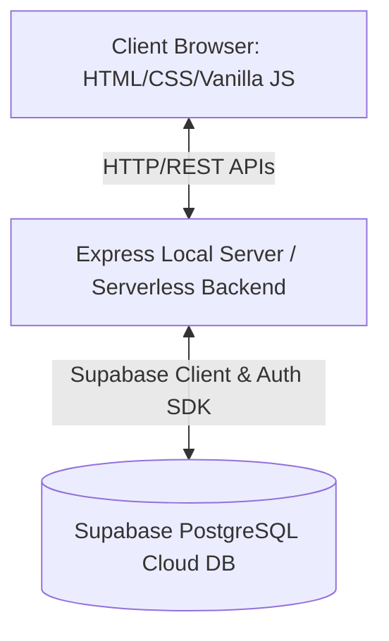

# DOKUMEN SPESIFIKASI KEBUTUHAN PERANGKAT LUNAK (SKPL)

## **Aplikasi GadgetStock: Sistem Manajemen Inventoris & Point of Sales Gadget**

---

### **Daftar Isi**
- [1. Pendahuluan](#1-pendahuluan)
  - [1.1 Tujuan Penulisan Dokumen](#11-tujuan-penulisan-dokumen)
  - [1.2 Lingkup Masalah](#12-lingkup-masalah)
  - [1.3 Definisi, Akronim, dan Singkatan](#13-definisi-akronim-dan-singkatan)
  - [1.4 Referensi](#14-referensi)
  - [1.5 Deskripsi Umum Dokumen](#15-deskripsi-umum-dokumen)
- [2. Deskripsi Umum Perangkat Lunak](#2-deskripsi-umum-perangkat-lunak)
  - [2.1 Deskripsi Umum Sistem](#21-deskripsi-umum-sistem)
  - [2.2 Fungsi Produk / Fitur Utama](#22-fungsi-produk--fitur-utama)
  - [2.3 Karakteristik Pengguna (Aktor)](#23-karakteristik-pengguna-aktor)
  - [2.4 Batasan-Batasan](#24-batasan-batasan)
  - [2.5 Asumsi dan Kebergantungan](#25-asumsi-dan-kebergantungan)
- [3. Spesifikasi Kebutuhan](#3-spesifikasi-kebutuhan)
  - [3.1 Kebutuhan Fungsional (Functional Requirements)](#31-kebutuhan-fungsional-functional-requirements)
  - [3.2 Kebutuhan Antarmuka Eksternal (External Interface Requirements)](#32-kebutuhan-antarmuka-eksternal-external-interface-requirements)
  - [3.3 Kebutuhan Non-Fungsional (Non-Functional Requirements)](#33-kebutuhan-non-fungsional-non-functional-requirements)
- [4. Spesifikasi Data & Basis Data](#4-spesifikasi-data--basis-data)
  - [4.1 Kamus Data & Struktur Tabel PostgreSQL](#41-kamus-data--struktur-tabel-postgresql)
  - [4.2 Keamanan & Aturan Row Level Security (RLS)](#42-keamanan--aturan-row-level-security-rls)

---

## **1. Pendahuluan**

### **1.1 Tujuan Penulisan Dokumen**
Dokumen Spesifikasi Kebutuhan Perangkat Lunak (SKPL) ini ditulis dengan tujuan untuk:
1. Mendefinisikan secara jelas, formal, dan komprehensif seluruh kebutuhan fungsional dan non-fungsional untuk aplikasi **GadgetStock**.
2. Menjadi acuan teknis yang sah bagi tim pengembang (*developers*), tim penguji (*testers*), serta pemilik bisnis (*stakeholders*) dalam mengevaluasi implementasi sistem.
3. Memastikan keselarasan pemahaman mengenai alur kerja POS (*Point of Sales*), pelacakan inventoris gadget, dan arsitektur database Supabase PostgreSQL.

### **1.2 Lingkup Masalah**
**GadgetStock** adalah perangkat lunak berbasis web yang dirancang khusus untuk memfasilitasi bisnis ritel gadget dalam mengelola persediaan barang secara efisien dan memproses transaksi penjualan secara cepat (Point of Sales). 
Sistem ini menangani:
- **Pengelolaan Inventoris Ritel**: Pendaftaran produk berdasarkan kategori gadget, pelacakan jumlah stok, harga beli, harga jual, serta pengunggahan gambar produk.
- **Kasir (Point of Sales)**: Pengolahan keranjang belanja secara *real-time*, kalkulasi pajak dinamis, integrasi multi-metode pembayaran (tunai, debit, QRIS, kredit), dan pencetakan struk penjualan digital.
- **Manajemen & Analitik Transaksi**: Pencatatan riwayat transaksi penjualan secara menyeluruh beserta log perubahan persediaan (*stock logs*) untuk keperluan audit stok, disertai grafik tren pendapatan harian dan bulanan.

### **1.3 Definisi, Akronim, dan Singkatan**
| Istilah/Singkatan | Definisi |
| :--- | :--- |
| **SKPL** | Spesifikasi Kebutuhan Perangkat Lunak (identik dengan *Software Requirements Specification* - SRS). |
| **POS** | *Point of Sales*, sistem mesin kasir digital tempat transaksi penjualan diproses. |
| **SKU** | *Stock Keeping Unit*, kode unik alfanumerik yang diberikan untuk mengidentifikasi setiap jenis produk gadget. |
| **SPA** | *Single Page Application*, aplikasi web yang memuat satu halaman HTML tunggal dan memperbarui konten secara dinamis tanpa me-refresh seluruh halaman. |
| **RLS** | *Row Level Security*, fitur keamanan tingkat baris pada database PostgreSQL untuk membatasi akses data berdasarkan peran dan identitas pengguna. |
| **UUID** | *Universally Unique Identifier*, standar identifikasi unik 128-bit yang digunakan sebagai primary key tabel. |
| **PPN** | Pajak Pertambahan Nilai (Tax Rate) flat yang diterapkan pada setiap transaksi ritel. |

### **1.4 Referensi**
1. *IEEE Std 830-1998, IEEE Recommended Practice for Software Requirements Specifications*.
2. Dokumentasi Desain Internal `DESIGN.md` GadgetStock.
3. Skema Basis Data Supabase PostgreSQL `supabase/schema.sql` GadgetStock.

### **1.5 Deskripsi Umum Dokumen**
Dokumen ini disusun dalam 4 bab utama. **Bab 1** memuat penjelasan pengantar, lingkup sistem, dan glosarium. **Bab 2** menjelaskan karakteristik sistem secara umum, fungsi utama, profil pengguna, batasan, serta kebergantungan arsitektur. **Bab 3** menjabarkan rincian kebutuhan fungsional (FR) dan kebutuhan antarmuka eksternal maupun non-fungsional (NFR). **Bab 4** berisi arsitektur data terperinci, spesifikasi tabel basis data, dan aturan keamanan berbasis PostgreSQL.

---

## **2. Deskripsi Umum Perangkat Lunak**

### **2.1 Deskripsi Umum Sistem**
GadgetStock merupakan aplikasi manajemen stok dan kasir ritel dengan arsitektur **Single Page Application (SPA)** di sisi klien dan arsitektur serverless/Express di sisi server. 

Antarmuka pengguna dikembangkan menggunakan teknologi Vanilla HTML5, CSS3 kustom yang modern, serta JavaScript ES6 murni untuk menjamin kecepatan loading yang instan. Data dan relasi entitas disimpan secara aman dalam cloud database **Supabase PostgreSQL** yang dikonfigurasi dengan aturan keamanan Row Level Security (RLS) serta otomasi basis data menggunakan *triggers* dan fungsi PLpgSQL.

### **2.2 Fungsi Produk / Fitur Utama**
Aplikasi GadgetStock menyediakan 7 pilar fitur utama:
1. **Sistem Autentikasi**: Autentikasi pengguna berbasis email/password dengan manajemen sesi yang aman dan pembagian peran pengguna (Admin, Manager, Cashier).
2. **Manajemen Produk & Persediaan**: Pengelolaan katalog gadget (tambah, edit, hapus, detail produk) lengkap dengan SKU, kategori khusus gadget (Smartphones, Laptops, Wearables, dll.), harga beli, harga jual, dan stok minimum.
3. **Point of Sales (POS) Kasir**: Grid produk dinamis berbasis kategori, kotak pencarian real-time, keranjang belanja interaktif dengan kalkulasi PPN otomatis, input nominal bayar, kalkulasi uang kembalian, dan modal konfirmasi sukses.
4. **Notifikasi Stok Kritis (*Low Stock Alert*)**: Modul peringatan otomatis untuk mengidentifikasi produk yang jumlah stoknya berada di bawah ambang batas minimum (*stock_min* atau threshold global).
5. **Riwayat & Detail Transaksi**: Modul pencatatan transaksi terpusat yang memungkinkan peninjauan riwayat penjualan secara rinci dengan opsi pembatalan transaksi (*void*) yang mengembalikan stok secara otomatis.
6. **Laporan & Analitik Penjualan**: Dashboard visualisasi tren pendapatan penjualan dalam grafik harian, bulanan, statistik performa produk terlaris, dan mutasi barang.
7. **Pengaturan Konfigurasi Toko**: Modul konfigurasi parameter operasional toko seperti nama toko, tarif pajak, batas minimum stok rendah global, serta teks footer pada struk cetak.

### **2.3 Karakteristik Pengguna (Aktor)**
Sistem GadgetStock mendefinisikan tiga level hak akses pengguna (*User Roles*):
1. **Cashier (Kasir)**:
   - Melakukan transaksi penjualan melalui modul POS.
   - Mencetak struk belanja transaksi yang baru selesai dibuat.
   - Melihat daftar inventoris produk dan informasi profil pribadi.
2. **Manager (Manajer)**:
   - Memiliki semua hak akses Kasir.
   - Mengelola data produk (menambah, mengubah informasi produk, dan memperbarui stok).
   - Melihat laporan statistik keuangan dan grafik analisis penjualan.
   - Melakukan *void* (pembatalan) transaksi penjualan.
3. **Administrator (Admin)**:
   - Memiliki hak akses penuh mutlak atas seluruh sistem.
   - Mengubah konfigurasi global sistem dan operasional toko di halaman Settings.
   - Melakukan operasi penulisan, pembaruan, dan penghapusan produk secara penuh.
   - Mengelola otentikasi profil pengguna baru.

### **2.4 Batasan-Batasan**
- **Aksesibilitas Browser**: Pengguna wajib menggunakan peramban modern yang mendukung fitur ES6, CSS Grid/Flexbox, dan JavaScript harus diaktifkan (misalnya Google Chrome v90+, Mozilla Firefox v88+, Microsoft Edge v90+).
- **Konektivitas**: Sistem memerlukan koneksi internet aktif untuk menghubungkan API lokal dengan database cloud Supabase, serta untuk proses sinkronisasi RLS.
- **Metode Pembayaran**: Transaksi POS hanya mendukung empat jenis metode pembayaran standar: Tunai (*Cash*), Debit, QRIS, dan Kredit.
- **Kebijakan Pajak**: Perhitungan pajak mengasumsikan nilai flat PPN (default 11%) yang diaplikasikan langsung pada subtotal pesanan.

### **2.5 Asumsi dan Kebergantungan**
- Database PostgreSQL berjalan di atas infrastruktur Supabase Cloud, sehingga keandalan penyimpanan data sangat bergantung pada ketersediaan layanan Supabase.
- Pengguna diasumsikan menjalankan Express local server (`server.js`) pada port `3000` di komputer lokal atau men-deploy-nya menggunakan Vercel Serverless Functions.

---

## **3. Spesifikasi Kebutuhan**

### **3.1 Kebutuhan Fungsional (Functional Requirements)**

Aplikasi GadgetStock membagi fungsionalitasnya menjadi kode-kode kebutuhan di bawah ini:

#### **A. Modul Keamanan & Autentikasi**
| ID Kebutuhan | Deskripsi Fitur / Kebutuhan Fungsional | Aktor |
| :--- | :--- | :--- |
| **FR-AUTH-01** | Sistem harus menyediakan formulir login menggunakan email dan kata sandi (*password*). | Semua Aktor |
| **FR-AUTH-02** | Sistem harus memvalidasi format email dan kesesuaian sandi melalui Supabase Auth. | Sistem |
| **FR-AUTH-03** | Sistem harus mengarahkan pengguna ke halaman Dashboard yang sesuai setelah login sukses. | Sistem |
| **FR-AUTH-04** | Sistem harus dapat mencegah pengguna yang tidak terautentikasi (*unauthorized*) untuk mengakses halaman internal (*route protection*). | Sistem |
| **FR-AUTH-05** | Sistem harus mengizinkan pengguna untuk keluar (*logout*) dan menghancurkan token sesi aktif. | Semua Aktor |

#### **B. Modul Dashboard & Analitik**
| ID Kebutuhan | Deskripsi Fitur / Kebutuhan Fungsional | Aktor |
| :--- | :--- | :--- |
| **FR-DSH-01** | Sistem harus menampilkan ringkasan kartu informasi (*metric cards*) berisi: Jumlah Total Produk Aktif, Transaksi Hari Ini, Total Pendapatan Bulan Ini, dan Jumlah Produk Stok Kritis. | Admin, Manager |
| **FR-DSH-02** | Sistem harus menyajikan visualisasi grafik interaktif untuk laporan tren pendapatan penjualan harian dan bulanan. | Admin, Manager |
| **FR-DSH-03** | Sistem harus menampilkan tabel log aktivitas terbaru (*recent stock logs*) pada halaman utama dashboard. | Admin, Manager |

#### **C. Modul Manajemen Inventoris (Products)**
| ID Kebutuhan | Deskripsi Fitur / Kebutuhan Fungsional | Aktor |
| :--- | :--- | :--- |
| **FR-INV-01** | Sistem harus menampilkan daftar produk dalam bentuk tabel responsif dengan fitur pencarian real-time berbasis nama produk atau SKU. | Semua Aktor |
| **FR-INV-02** | Sistem harus mendukung filter daftar produk berdasarkan Kategori Gadget (Smartphones, Wearables, Accessories, Tablets, Laptops, Audio, Other). | Semua Aktor |
| **FR-INV-03** | Sistem harus menyediakan fitur tambah produk baru dengan data masukan wajib: SKU unik, Nama Produk, Kategori, Harga Beli, Harga Jual, Stok Awal, dan Stok Minimum. | Admin, Manager |
| **FR-INV-04** | Sistem harus mendukung fitur pengeditan data produk yang sudah ada. | Admin, Manager |
| **FR-INV-05** | Sistem harus mendukung fitur pengunggahan file gambar produk untuk menggantikan input URL gambar manual. | Admin, Manager |
| **FR-INV-06** | Sistem harus dapat menonaktifkan (*is_active = false*) atau menghapus produk dari inventoris secara permanen. | Admin, Manager |
| **FR-INV-07** | Sistem harus menandai secara visual (menggunakan badge warna merah/kuning) produk yang memiliki jumlah stok sama dengan atau di bawah batas minimum (*stock_min*). | Semua Aktor |

#### **D. Modul Point of Sales (POS)**
| ID Kebutuhan | Deskripsi Fitur / Kebutuhan Fungsional | Aktor |
| :--- | :--- | :--- |
| **FR-POS-01** | Sistem harus menampilkan grid katalog produk aktif yang dapat diklik untuk dimasukkan ke dalam keranjang belanja (*shopping cart*). | Semua Aktor |
| **FR-POS-02** | Keranjang belanja harus dapat memperbarui kuantitas produk secara dinamis, mengkalkulasi subtotal secara instan, dan menghapus item. | Semua Aktor |
| **FR-POS-03** | Sistem harus melarang penambahan kuantitas barang ke keranjang belanja jika kuantitas tersebut melebihi stok fisik produk yang tersedia. | Sistem |
| **FR-POS-04** | Sistem harus menghitung Pajak PPN secara otomatis berdasarkan persentase tarif pajak yang terkonfigurasi di sistem. | Sistem |
| **FR-POS-05** | Sistem harus menyediakan form pembayaran dengan pilihan metode: Cash, Debit, QRIS, Credit. | Semua Aktor |
| **FR-POS-06** | Untuk metode pembayaran *Cash* (Tunai), sistem harus menghitung nilai uang kembalian (*change*) berdasarkan input nominal uang yang diterima dari pelanggan. | Semua Aktor |
| **FR-POS-07** | Setelah transaksi berhasil disimpan, sistem harus mengurangi stok fisik produk secara otomatis di database dan mencatat log perubahan ke tabel *stock_logs*. | Sistem |
| **FR-POS-08** | Sistem harus menyediakan struk belanja dinamis dan opsi cetak (*print receipt*) secara langsung via browser web. | Semua Aktor |

#### **E. Modul Transaksi & Log Stok**
| ID Kebutuhan | Deskripsi Fitur / Kebutuhan Fungsional | Aktor |
| :--- | :--- | :--- |
| **FR-TXN-01** | Sistem harus menyajikan tabel riwayat transaksi lengkap dengan filter tanggal, pencarian nomor struk, dan filter status (Completed, Voided). | Semua Aktor |
| **FR-TXN-02** | Sistem harus menampilkan drawer/modal detail transaksi berisi daftar item produk yang dibeli, harga satuan saat dibeli, subtotal, identitas kasir, nomor terminal, dan catatan tambahan. | Semua Aktor |
| **FR-TXN-03** | Sistem harus mengizinkan pembatalan transaksi (*void transaction*). Tindakan void harus mengembalikan stok barang ke jumlah semula dan memperbarui status transaksi menjadi 'voided'. | Admin, Manager |
| **FR-TXN-04** | Sistem harus mencatat secara terperinci setiap aktivitas perubahan stok (*stock logs*) yang mencantumkan tipe perubahan (*sale, restock, adjustment, audit, initial*), jumlah stok sebelum, perubahan kuantitas, dan stok setelah perubahan. | Sistem |

#### **F. Modul Pengaturan (Settings)**
| ID Kebutuhan | Deskripsi Fitur / Kebutuhan Fungsional | Aktor |
| :--- | :--- | :--- |
| **FR-SET-01** | Sistem harus dapat memuat konfigurasi aktif dari tabel database `settings` saat aplikasi diinisialisasi. | Sistem |
| **FR-SET-02** | Sistem harus mengizinkan perubahan konfigurasi: Nama Toko, Tarif PPN (%), Batas Stok Rendah Global, dan Footer Cetak Struk. | Admin |

---

### **3.2 Kebutuhan Antarmuka Eksternal (External Interface Requirements)**

#### **3.2.1 Antarmuka Pengguna (User Interface)**
Desain antarmuka GadgetStock dirancang dengan vanilla CSS premium yang mengutamakan kenyamanan mata kasir dan manajer yang menatap layar dalam durasi lama.
- **Tipografi**: Menggunakan Google Fonts **Inter** sebagai font utama ritel, dan **JetBrains Mono** untuk representasi angka tabular, kode SKU, dan struk belanja agar presisi.
- **Skema Warna Premium**:
  - Warna Utama (*Primary*): Navy Blue / Dark Blue (`#001f3f`) untuk sidebar aktif dan penegasan aksi.
  - Warna Latar (*Background*): Slate Off-white (`#f8f9fa`) yang bersih.
  - Warna Kartu (*Surface*): Putih murni (`#ffffff`) dengan bayangan halus (*subtle shadow* `0 1px 3px rgba(0,0,0,0.04)`).
  - Feedback visual yang dinamis: Hijau untuk sukses/stok aman, Kuning untuk stok menipis, dan Merah untuk stok kritis/habis.
- **Tata Letak (Layouting)**:
  - **Desktop**: Layout sidebar vertikal statis dengan lebar 256px di sisi kiri dan konten dinamis di sisi kanan. Top bar transparan dengan efek *blur glassmorphism* (`backdrop-filter: blur(12px)`).
  - **Mobile Layout**: Sidebar disembunyikan dan digantikan dengan menu *Bottom Navigation* ramah jempol.
  - **POS Panel Ganda**: Panel kiri menampilkan katalog grid produk, panel kanan didedikasikan untuk detail struk belanja dan pembayaran kasir.
- **Mikro-Animasi**: Transisi halus di setiap elemen hover, animasi memantul taktil saat tombol diklik (`transform: scale(0.97)`), skeleton loader untuk pengganti blank screen saat proses fetching.

#### **3.2.2 Antarmuka Perangkat Lunak (Software Interface)**
- **Sistem Operasi Klien**: Multiplatform (Windows, Linux, macOS, Android, iOS) yang memiliki web browser.
- **Bahasa Pemrograman Klien**: JavaScript (ES6+), HTML5, CSS3.
- **Runtime Sisi Server**: Node.js v16+ dengan framework Express.js.
- **Database Client**: `@supabase/supabase-js` SDK untuk interaksi API PostgreSQL langsung dari sisi klien maupun server.

#### **3.2.3 Antarmuka Perangkat Keras (Hardware Interface)**
Aplikasi ini dirancang berjalan pada perangkat keras standar berikut:
- Komputer Desktop, Laptop, atau Tablet Kasir dengan resolusi layar minimal 1024x768 piksel untuk kenyamanan POS.
- Printer Termal Struk (58mm atau 80mm) yang terhubung ke sistem operasi klien untuk mencetak struk belanja fisik.
- Pemindai kode batang (*Barcode Scanner*) yang berperan sebagai input keyboard emulator untuk input SKU secara cepat pada kotak pencarian POS.

#### **3.2.4 Antarmuka Komunikasi (Communication Interface)**
- Protokol transfer komunikasi data menggunakan **HTTPS** untuk menjamin keamanan pertukaran data antara client, Express server, dan endpoint API REST Supabase.
- Pengiriman data transaksi POS dalam format terenkripsi **JSON**.

---

### **3.3 Kebutuhan Non-Fungsional (Non-Functional Requirements)**

| Parameter NFR | Deskripsi Spesifikasi Kebutuhan |
| :--- | :--- |
| **Kinerja (Performance)** | - Waktu respons transisi antar halaman dalam SPA harus di bawah 150 milidetik. - Waktu proses eksekusi checkout transaksi hingga struk tercetak di layar tidak boleh melebihi 1,5 detik pada koneksi internet standar (min 5 Mbps). - Kueri inventoris harus dioptimalkan dengan pembuatan indeks database pada kolom SKU, Kategori, dan Status Aktif. |
| **Keamanan (Security)** | - Semua data komunikasi sensitif dilindungi dengan otentikasi JWT Supabase. - Semua kueri langsung atau perubahan data ke database dibatasi oleh kebijakan PostgreSQL Row Level Security (RLS). - Kata sandi pengguna dienkripsi secara satu arah (*salted hashing*) oleh Supabase Auth. |
| **Keandalan (Reliability)** | - Database didesain untuk memiliki tingkat toleransi kesalahan tinggi di atas cloud Supabase dengan jaminan uptime minimal 99,9%. |
| **Ketersediaan (Availability)** | - Sistem harus dapat beroperasi 24 jam sehari, 7 hari seminggu (24/7) untuk mendukung operasional retail non-stop. |
| **Kemudahan Penggunaan (Usability)** | - Antarmuka POS kasir dirancang dengan alur intuitif tanpa perlu pelatihan khusus yang mendalam bagi kasir baru. - Desain bersifat responsif dan beradaptasi otomatis pada layar tablet berukuran 10 inci. |

---

## **4. Spesifikasi Data & Basis Data**

### **4.1 Kamus Data & Struktur Tabel PostgreSQL**

Berikut adalah detail skema database PostgreSQL yang diimplementasikan pada backend GadgetStock:

#### **1. Tabel `profiles`**
Menyimpan informasi tambahan untuk akun pengguna yang terintegrasi dengan tabel autentikasi bawaan Supabase (`auth.users`).
- **Primary Key**: `id` (UUID)

| Nama Kolom | Tipe Data | Nullable | Default | Keterangan / Batasan |
| :--- | :--- | :--- | :--- | :--- |
| `id` | UUID | NO | - | Menghubungkan ke `auth.users(id)` (ON DELETE CASCADE) |
| `full_name` | VARCHAR(255) | YES | - | Nama lengkap pemilik akun pengguna. |
| `role` | VARCHAR(50) | NO | 'cashier' | Peran pengguna. Batasan nilai: `('cashier', 'manager', 'admin')`. |
| `terminal` | VARCHAR(50) | YES | 'Terminal 01' | Nama terminal kasir yang sedang digunakan. |
| `avatar_url` | TEXT | YES | - | Link gambar foto profil pengguna. |
| `created_at` | TIMESTAMPTZ | YES | NOW() | Tanggal & waktu profil dibuat. |

---

#### **2. Tabel `products`**
Menyimpan katalog produk gadget yang tersedia di toko.
- **Primary Key**: `id` (UUID)

| Nama Kolom | Tipe Data | Nullable | Default | Keterangan / Batasan |
| :--- | :--- | :--- | :--- | :--- |
| `id` | UUID | NO | gen_random_uuid()| ID unik produk gadget. |
| `sku` | VARCHAR(50) | NO | - | Kode SKU unik (*Unique Constraint*). |
| `name` | VARCHAR(255) | NO | - | Nama barang gadget. |
| `brand` | VARCHAR(100) | YES | - | Merek gadget (contoh: Apple, Samsung, Sony). |
| `category` | VARCHAR(100) | YES | - | Batasan Kategori: `('Smartphones','Wearables','Accessories','Tablets','Laptops','Audio','Other')` |
| `description` | TEXT | YES | - | Deskripsi spesifikasi gadget secara rinci. |
| `price_sell` | BIGINT | NO | - | Harga jual ke pelanggan. Harus >= 0. |
| `price_buy` | BIGINT | YES | 0 | Harga beli modal dari distributor. |
| `stock` | INTEGER | YES | 0 | Jumlah stok fisik saat ini di toko. Harus >= 0. |
| `stock_min` | INTEGER | YES | 5 | Batas minimum stok sebelum memicu peringatan kritis. |
| `image_url` | TEXT | YES | - | URL atau path penyimpanan gambar produk. |
| `is_active` | BOOLEAN | YES | TRUE | Menentukan apakah produk aktif dipajang di POS. |
| `created_at` | TIMESTAMPTZ | YES | NOW() | Tanggal produk didaftarkan pertama kali. |
| `updated_at` | TIMESTAMPTZ | YES | NOW() | Tanggal modifikasi terakhir (diperbarui otomatis via trigger). |

---

#### **3. Tabel `transactions`**
Menyimpan ringkasan transaksi penjualan ritel di kasir.
- **Primary Key**: `id` (UUID)

| Nama Kolom | Tipe Data | Nullable | Default | Keterangan / Batasan |
| :--- | :--- | :--- | :--- | :--- |
| `id` | UUID | NO | gen_random_uuid()| ID unik transaksi penjualan. |
| `txn_number` | VARCHAR(30) | YES | - | Nomor struk unik (misal: GS-20260520-001) (*Unique*). |
| `cashier_id` | UUID | YES | - | Relasi foreign key ke tabel `profiles(id)`. |
| `customer_name`| VARCHAR(255) | YES | 'Walk-in Customer'| Nama pembeli/pelanggan. |
| `subtotal` | BIGINT | NO | - | Total belanja sebelum dikenakan pajak PPN. |
| `tax_amount` | BIGINT | NO | - | Total nilai nominal pajak yang dikenakan. |
| `total` | BIGINT | NO | - | Total bersih belanjaan yang harus dibayar (`subtotal + tax_amount`). |
| `payment_method`| VARCHAR(50) | YES | - | Batasan Metode: `('cash','debit','qris','credit')`. |
| `cash_received`| BIGINT | YES | - | Jumlah nominal uang yang diserahkan pelanggan (khusus Cash). |
| `change_amount`| BIGINT | YES | - | Jumlah uang kembalian yang diberikan ke pelanggan. |
| `status` | VARCHAR(20) | YES | 'completed' | Status transaksi. Batasan: `('pending','completed','voided')`. |
| `terminal` | VARCHAR(50) | YES | 'Terminal 01' | Terminal kasir tempat transaksi diproses. |
| `notes` | TEXT | YES | - | Catatan opsional transaksi. |
| `created_at` | TIMESTAMPTZ | YES | NOW() | Tanggal dan waktu transaksi sukses diselesaikan. |

---

#### **4. Tabel `transaction_items`**
Menyimpan rincian item produk yang terjual dalam setiap transaksi (*Transaction Line Items*).
- **Primary Key**: `id` (UUID)

| Nama Kolom | Tipe Data | Nullable | Default | Keterangan / Batasan |
| :--- | :--- | :--- | :--- | :--- |
| `id` | UUID | NO | gen_random_uuid()| ID unik rincian item transaksi. |
| `transaction_id`| UUID | NO | - | Relasi foreign key ke tabel `transactions(id)` (ON DELETE CASCADE). |
| `product_id` | UUID | YES | - | Relasi foreign key ke tabel `products(id)`. |
| `product_name` | VARCHAR(255) | YES | - | Snapshot nama produk saat dibeli (mencegah inkonsistensi jika nama produk diedit nanti). |
| `product_sku` | VARCHAR(50) | YES | - | Snapshot kode SKU produk saat dibeli. |
| `quantity` | INTEGER | NO | - | Jumlah kuantitas produk yang dibeli. Harus > 0. |
| `unit_price` | BIGINT | NO | - | Snapshot harga jual per unit produk saat transaksi. |
| `subtotal` | BIGINT | NO | - | Total harga item belanjaan (`quantity * unit_price`). |

---

#### **5. Tabel `stock_logs`**
Menyimpan catatan historis setiap perubahan mutasi stok produk untuk kebutuhan pengawasan inventoris.
- **Primary Key**: `id` (UUID)

| Nama Kolom | Tipe Data | Nullable | Default | Keterangan / Batasan |
| :--- | :--- | :--- | :--- | :--- |
| `id` | UUID | NO | gen_random_uuid()| ID unik log mutasi stok. |
| `product_id` | UUID | YES | - | Relasi foreign key ke tabel `products(id)` (ON DELETE CASCADE). |
| `change_type` | VARCHAR(50) | YES | - | Jenis aktivitas: `('sale','restock','adjustment','audit','initial')`. |
| `qty_before` | INTEGER | YES | - | Jumlah stok fisik sesaat sebelum perubahan dilakukan. |
| `qty_change` | INTEGER | YES | - | Perubahan kuantitas stok (positif jika bertambah, negatif jika berkurang). |
| `qty_after` | INTEGER | YES | - | Jumlah stok fisik sesaat setelah perubahan selesai. |
| `note` | TEXT | YES | - | Catatan penjelasan/alasan mutasi (misal: "Transaksi Kasir GS-XXX"). |
| `created_by` | UUID | YES | - | User pengubah. Relasi foreign key ke `profiles(id)`. |
| `transaction_id`| UUID | YES | - | Relasi foreign key opsional ke `transactions(id)` jika bersumber dari POS. |
| `created_at` | TIMESTAMPTZ | YES | NOW() | Tanggal & waktu mutasi dicatat. |

---

#### **6. Tabel `settings`**
Menyimpan data konfigurasi global sistem dengan model pasangan kunci-nilai (*key-value*).
- **Primary Key**: `key` (TEXT)

| Nama Kolom | Tipe Data | Nullable | Keterangan | Nilai Awal Default |
| :--- | :--- | :--- | :--- | :--- |
| `key` | TEXT | NO | Kunci nama konfigurasi unik. | `'tax_rate'`, `'store_name'`, `'low_stock_threshold'`, `'receipt_footer'` |
| `value` | TEXT | NO | Nilai dari konfigurasi aktif. | `'0.11'`, `'GadgetStock'`, `'10'`, `'Terima kasih telah berbelanja!'` |

---

### **4.2 Keamanan & Aturan Row Level Security (RLS)**

Database PostgreSQL GadgetStock mengaktifkan **Row Level Security (RLS)** pada seluruh tabel transaksi dan data untuk mencegah modifikasi tidak sah.

> [!IMPORTANT]
> Keamanan data dilindungi ketat di level basis data dengan kebijakan-kebijakan berikut:

1. **Keamanan Tabel `profiles`**:
   - Kebijakan `profiles_select`: Semua pengguna dengan sesi terautentikasi (`authenticated`) diperbolehkan membaca data profil kasir lainnya.
   - Kebijakan `profiles_update`: Pengguna hanya diperbolehkan mengubah data profil miliknya sendiri (`auth.uid() = id`).

2. **Keamanan Tabel `products`**:
   - Kebijakan `products_select`: Semua pengguna terautentikasi dapat melihat katalog produk gadget.
   - Kebijakan Menulis (`insert`/`update`/`delete`): Hanya pengguna dengan peran `manager` atau `admin` di tabel `profiles` yang diizinkan memodifikasi, menambah, atau menghapus produk di database.

3. **Keamanan Tabel `transactions` & `transaction_items`**:
   - Kebijakan Membaca & Menulis (`select`/`insert`): Seluruh pengguna terautentikasi (Kasir, Manajer, Admin) dapat mencatat transaksi baru dan membaca data riwayat transaksi penjualan.
   - Kebijakan Mengubah (`update`): Hanya aktor dengan peran `manager` atau `admin` yang diizinkan memperbarui transaksi (untuk kebutuhan status void).

4. **Keamanan Tabel `stock_logs`**:
   - Seluruh pengguna terautentikasi dapat membaca riwayat perubahan stok (`select`) dan mendaftarkan mutasi stok baru (`insert`) saat transaksi POS berlangsung.

---

### **Kesimpulan**
Spesifikasi Kebutuhan Perangkat Lunak (SKPL) ini mendefinisikan standar pengembangan sistem **GadgetStock** agar menjadi aplikasi yang aman, andal, dan memiliki kinerja tinggi dalam melayani pencatatan transaksi ritel gadget serta manajemen logistik pergudangan.
