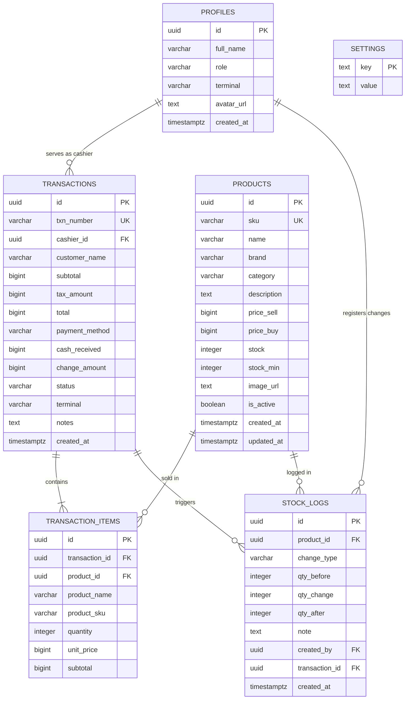

# DOKUMEN SPESIFIKASI KEBUTUHAN PERANGKAT LUNAK (SKPL)

## GADGETSTOCK: SISTEM POINT OF SALE & INVENTORY MANAGEMENT MODERN

---

| **Atribut Dokumen** | **Detail** |
| --- | --- |
| **Nama Proyek** | GadgetStock |
| **Tujuan Dokumen** | Spesifikasi Kebutuhan Perangkat Lunak (SKPL) |
| **Versi Dokumen** | 1.0.0 |
| **Tanggal Pembuatan** | 20 Mei 2026 |
| **Status** | Selesai |
| **Lingkungan Basis Data** | PostgreSQL (Supabase) dengan Skema RLS aktif |
| **Arsitektur Aplikasi** | Single Page Application (SPA) berbasis Vanilla JS, Express Local Server |
| **Penyusun** | Tim Pengembang GadgetStock (Rekayasa Perangkat Lunak) |

---

## DAFTAR ISI

- [BAB I: PENDAHULUAN](#bab-i-pendahuluan)
  - [1.1 Tujuan Penulisan Dokumen](#11-tujuan-penulisan-dokumen)
  - [1.2 Lingkup Masalah](#12-lingkup-masalah)
  - [1.3 Definisi, Akronim, dan Singkatan](#13-definisi-akronim-dan-singkatan)
  - [1.4 Referensi](#14-referensi)
  - [1.5 Deskripsi Umum Dokumen](#15-deskripsi-umum-dokumen)
- [BAB II: DESKRIPSI UMUM PERANGKAT LUNAK](#bab-ii-deskripsi-umum-perangkat-lunak)
  - [2.1 Perspektif Produk](#21-perspektif-produk)
  - [2.2 Fungsi Produk](#22-fungsi-produk)
  - [2.3 Karakteristik Pengguna](#23-karakteristik-pengguna)
  - [2.4 Batasan-Batasan Sistem](#24-batasan-batasan-sistem)
  - [2.5 Asumsi dan Ketergantungan](#25-asumsi-dan-ketergantungan)
- [BAB III: SPESIFIKASI KEBUTUHAN](#bab-iii-spesifikasi-kebutuhan)
  - [3.1 Kebutuhan Antarmuka Eksternal](#31-kebutuhan-antarmuka-eksternal)
    - [3.1.1 Antarmuka Pengguna (User Interface)](#311-antarmuka-pengguna-user-interface)
    - [3.1.2 Antarmuka Perangkat Keras (Hardware Interface)](#312-antarmuka-perangkat-keras-hardware-interface)
    - [3.1.3 Antarmuka Perangkat Lunak (Software Interface)](#313-antarmuka-perangkat-lunak-software-interface)
    - [3.1.4 Antarmuka Komunikasi (Communication Interface)](#314-antarmuka-komunikasi-communication-interface)
  - [3.2 Kebutuhan Fungsional (Functional Requirements)](#32-kebutuhan-fungsional-functional-requirements)
    - [3.2.1 Use Case Diagram](#321-use-case-diagram)
    - [3.2.2 Deskripsi Kebutuhan Fungsional (FR)](#322-deskripsi-kebutuhan-fungsional-fr)
  - [3.3 Kebutuhan Data (Data Requirements)](#33-kebutuhan-data-data-requirements)
    - [3.3.1 Entity Relationship Diagram (ERD)](#331-entity-relationship-diagram-erd)
    - [3.3.2 Kamus Data & Struktur Tabel](#332-kamus-data--struktur-tabel)
  - [3.4 Kebutuhan Non-Fungsional (Non-Functional Requirements)](#34-kebutuhan-non-fungsional-non-functional-requirements)

---

## BAB I: PENDAHULUAN

### 1.1 Tujuan Penulisan Dokumen
Dokumen Spesifikasi Kebutuhan Perangkat Lunak (SKPL) ini disusun untuk memberikan deskripsi komprehensif mengenai fungsionalitas, arsitektur, kebutuhan data, antarmuka, serta spesifikasi non-fungsional dari sistem manajemen inventaris dan Point of Sale (POS) **GadgetStock**. Dokumen ini ditujukan sebagai:
1. **Panduan bagi Tim Pengembang** dalam mengimplementasikan, memelihara, dan mengembangkan fitur-fitur pada aplikasi GadgetStock.
2. **Dokumentasi Teknis Proyek** dalam ranah Rekayasa Perangkat Lunak guna memastikan kualitas dan konsistensi sistem.
3. **Kontrak Kesepakatan Teknis** antara pengembang dan pemangku kepentingan mengenai fitur dan spesifikasi sistem yang diimplementasikan.

### 1.2 Lingkup Masalah
**GadgetStock** adalah sebuah sistem terintegrasi yang memadukan fungsi manajemen persediaan barang (inventory tracking) dengan transaksi kasir langsung (Point of Sale - POS) yang dirancang khusus untuk toko ritel gadget (smartphone, wearables, audio, tablet, laptop, dan aksesori). Sistem ini mengatasi kendala operasional ritel tradisional seperti:
- Ketidakakuratan jumlah stok barang akibat pencatatan penjualan dan stok yang terpisah.
- Keterlambatan penanganan stok menipis (low-stock warning).
- Rumitnya proses pelaporan transaksi harian dan bulanan yang harus direkap secara manual.
- Kebutuhan akan antarmuka kasir yang lincah, adaptif untuk perangkat desktop maupun mobile (tablet/smartphone), serta mendukung scan barcode produk secara instan menggunakan kamera bawaan perangkat.

Sistem GadgetStock mengadopsi arsitektur web modern Single Page Application (SPA) berbasis JavaScript murni (Vanilla JS) dengan navigasi hash-based routing. Untuk pengolahan data persediaan dan transaksi yang andal, sistem ini terintegrasi langsung dengan database PostgreSQL di cloud menggunakan **Supabase**, yang menerapkan **Row Level Security (RLS)** demi perlindungan data tingkat lanjut dan pemisahan hak akses per peran pengguna (*role*).

### 1.3 Definisi, Akronim, dan Singkatan
- **SKPL**: Spesifikasi Kebutuhan Perangkat Lunak (atau *Software Requirements Specification* - SRS).
- **POS**: *Point of Sale*, area kasir tempat transaksi penjualan ritel diselesaikan.
- **SKU**: *Stock Keeping Unit*, kode unik alfanumerik yang diidentifikasikan ke setiap produk untuk pelacakan persediaan.
- **SPA**: *Single Page Application*, aplikasi web yang berjalan di dalam browser dan memuat halaman secara dinamis tanpa melakukan reload halaman secara penuh.
- **RLS**: *Row Level Security*, mekanisme keamanan tingkat baris pada database PostgreSQL untuk membatasi query data berdasarkan otorisasi user aktif.
- **JSON**: *JavaScript Object Notation*, format pertukaran data ringan yang digunakan untuk komunikasi antara klien dan server.
- **Express**: Framework web minimalis untuk Node.js yang melayani API lokal.

### 1.4 Referensi
1. IEEE Std 830-1998, *IEEE Recommended Practice for Software Requirements Specifications*.
2. Dokumentasi Resmi Supabase & PostgreSQL Row Level Security (RLS).
3. Panduan Arsitektur Aplikasi SPA Web Modern dan Material You Design System.
4. Kode sumber aplikasi GadgetStock (`DESIGN.md`, `server.js`, dan struktur direktori `/public`).

### 1.5 Deskripsi Umum Dokumen
Dokumen ini disusun menjadi tiga bab utama:
* **BAB I: Pendahuluan**, memuat tujuan penulisan, ruang lingkup produk, definisi teknis, referensi dokumen, dan ikhtisar struktur SKPL.
* **BAB II: Deskripsi Umum Perangkat Lunak**, memaparkan arsitektur produk, fungsi-fungsi utama sistem secara makro, klasifikasi profil pengguna, batasan teknis operasional, serta asumsi dependensi.
* **BAB III: Spesifikasi Kebutuhan**, berisi rincian antarmuka eksternal (UI, hardware, software, komunikasi), spesifikasi kebutuhan fungsional (FR) yang disertai Use Case Diagram, spesifikasi kebutuhan data (ERD dan rincian tabel database PostgreSQL), serta kebutuhan non-fungsional sistem.

---

## BAB II: DESKRIPSI UMUM PERANGKAT LUNAK

### 2.1 Perspektif Produk
GadgetStock merupakan sistem kasir pintar (Point of Sale) yang bersifat mandiri (*standalone*) namun terkoneksi secara terdistribusi. Sistem kasir ini beroperasi pada arsitektur hybrid:
* **Sisi Klien (Frontend)**: Berupa web SPA responsif yang memanfaatkan dynamic routing hash-based (`public/js/router.js`) dan state management terpusat (`public/js/state.js`). Antarmuka dirancang menggunakan CSS murni (Vanilla CSS) yang mengikuti panduan Material You Design System.
* **Sisi Server Lokal (Backend local)**: Node.js Express server (`server.js`) yang bertindak sebagai adapter serverless function untuk mempermudah eksekusi API lokal dan menyediakan fitur *SPA fallback routing*.
* **Sisi Cloud (Database & Authentication)**: Database PostgreSQL Supabase yang mengamankan transaksi, data produk, log stok, dan profil pengguna melalui filter *Row Level Security (RLS)*. 

```
┌─────────────────────────────────────────────────────────────┐
│                       SISI KLIEN                            │
│ ┌─────────────────────────────────────────────────────────┐ │
│ │                  Browser Web (SPA)                      │ │
│ │ ┌──────────────────┐ ┌────────────────┐ ┌─────────────┐ │ │
│ │ │ Router (hash)    │ │ State Manager  │ │ UI / CSS    │ │ │
│ │ └────────┬─────────┘ └───────┬────────┘ └─────────────┘ │ │
│ └──────────┼───────────────────┼──────────────────────────┘ │
└────────────┼───────────────────┼────────────────────────────┘
             │ HTTP              │ WebSocket (Realtime)
┌────────────▼───────────────────▼────────────────────────────┐
│                    API SERVER / CLOUD                       │
│ ┌─────────────────────────┐   ┌───────────────────────────┐ │
│ │ Express Local API Server│   │ PostgreSQL Supabase Cloud │ │
│ │ (Middleware & Routes)   │   │ (RLS Polices, Auth, DB)   │ │
│ └─────────────────────────┘   └───────────────────────────┘ │
└─────────────────────────────────────────────────────────────┘
```

### 2.2 Fungsi Produk
Sistem GadgetStock memiliki fungsi-fungsi utama sebagai berikut:
1. **Sistem Autentikasi Pengguna**: Memproses pendaftaran, masuk (*login*), keluar (*logout*), deteksi sesi pengguna, dan pembagian hak akses (*Role-based Access Control*) secara dinamis.
2. **Point of Sale (POS) Kasir**:
   - Pencarian barang berdasarkan nama, SKU, atau kategori.
   - Fitur Scan Barcode instan dengan kamera perangkat.
   - Manajemen Keranjang Belanja Kasir (Tambah produk, kalkulasi kuantitas secara interaktif, tombol hapus/reset keranjang).
   - Penginputan profil nama pelanggan (*customer profile*).
   - Kalkulasi otomatis subtotal, pajak (PPN sesuai setelan, default 11%), dan grand total transaksi.
   - Proses Checkout penjualan dengan berbagai metode pembayaran (Cash, Debit, QRIS, Credit).
   - Perekaman nominal uang diterima (*cash received*) dan kalkulasi uang kembalian secara presisi.
3. **Pencetakan & Manajemen Receipt**: Merender nota/struk penjualan digital secara terformat rapi untuk dicetak maupun disimpan sebagai bukti transaksi fisik.
4. **Manajemen Persediaan (Inventory)**:
   - Menampilkan daftar inventori secara komprehensif, dilengkapi status stok (*Aman*, *Menipis*, *Habis*).
   - Penambahan produk baru dengan input berkode SKU unik, merek (*brand*), kategori produk, deskripsi produk, harga beli, harga jual, kuantitas stok awal, batas stok minimum (*stock_min*), serta upload gambar produk berbasis file lokal.
   - Pembaruan informasi produk (*edit*) dan penghapusan produk (*delete*).
   - Pengawasan otomatis untuk produk di bawah ambang batas minimum stok (*low-stock list & notification*).
5. **Riwayat Transaksi (History)**: Menampilkan riwayat transaksi penjualan ritel secara kronologis terperinci, dengan detail barang yang terjual (*transaction items*).
6. **Laporan Penjualan & Analitik**:
   - Menyajikan ringkasan performa finansial (Pendapatan Kotor, Laba Bersih, Jumlah Transaksi, Total Item Terjual).
   - Visualisasi grafik interaktif tren penjualan harian dan bulanan.
   - Laporan barang terlaris (*Top Selling Products*) dan kategori paling diminati.
7. **Pengaturan Sistem (Settings)**:
   - Konfigurasi parameter toko (Nama toko, nama terminal aktif).
   - Konfigurasi pajak PPN (tax rate) dan ambang batas stok kritis umum.
   - Konfigurasi footer nota belanja.

### 2.3 Karakteristik Pengguna
Hak akses dan interaksi pengguna ke sistem diklasifikasikan ke dalam 3 peran (*role*):
1. **Cashier (Kasir)**:
   - Dapat mengakses modul POS kasir untuk memproses transaksi.
   - Dapat mengoperasikan kamera pemindai barcode.
   - Dapat melihat riwayat transaksi yang dilayaninya sendiri.
   - Tidak berwenang melakukan modifikasi data master inventaris barang (tambah/edit/hapus produk) dan tidak dapat mengakses modul Laporan Keuangan/Analitik/Konfigurasi Sistem.
2. **Store Manager (Manajer Toko)**:
   - Memiliki akses penuh terhadap modul POS kasir.
   - Memiliki wewenang mutlak untuk mengelola master data produk (tambah, edit, hapus produk di modul Inventory).
   - Dapat mengakses modul Analitik, Laporan Penjualan (Harian & Bulanan), dan Log Perubahan Stok (*Stock Logs*).
   - Dapat mengubah parameter konfigurasi toko di modul Settings.
3. **System Admin (Administrator Sistem)**:
   - Bertanggung jawab penuh terhadap pemeliharaan basis data.
   - Berwenang mengelola profil dan *role* dari para pengguna sistem (profiles).
   - Memiliki hak akses penuh (*Superuser*) ke seluruh bagian sistem termasuk bypass Row Level Security untuk kepentingan audit data.

### 2.4 Batasan-Batasan Sistem
* **Koneksi Jaringan**: Sistem sangat bergantung pada koneksi internet untuk melakukan sinkronisasi data secara real-time ke Supabase PostgreSQL Cloud. Jika koneksi terputus, sistem akan mengaktifkan *Demo / Guest Mode* yang menyimpan data transaksi di memori internal klien secara temporer (data hilang saat reload).
* **Ukuran Layar**: Responsivitas sistem dirancang untuk menangani dua jenis layout: desktop (sidebar vertikal) dan mobile (bottom navigation bar). Performa optimal untuk fitur kasir POS direkomendasikan menggunakan tablet/PC dengan resolusi lebar layar minimal 768px untuk kenyamanan layout nota di sebelah kanan.
* **Ketergantungan Hardware**: Pemindaian barcode memerlukan ketersediaan modul kamera video beresolusi minimal 720p dengan dukungan API browser `navigator.mediaDevices.getUserMedia`.

### 2.5 Asumsi dan Ketergantungan
* **Browser Web**: Diasumsikan pengguna menjalankan sistem pada browser web modern (Google Chrome v90+, Mozilla Firefox v88+, Safari v14+, Microsoft Edge v90+) yang mendukung fitur ES6 Modules, Flexbox/Grid CSS, LocalStorage, dan SessionStorage.
* **Database Server**: Supabase DB diasumsikan selalu berada pada kondisi aktif dan stabil untuk merespon API request dari klien.
* **Pajak Toko**: Mengikuti peraturan perpajakan di Indonesia di mana tarif default Pajak Pertambahan Nilai (PPN) adalah 11% (dapat disesuaikan di Settings).

---

## BAB III: SPESIFIKASI KEBUTUHAN

### 3.1 Kebutuhan Antarmuka Eksternal

#### 3.1.1 Antarmuka Pengguna (User Interface)
* **Tema dan Gaya**: Mengusung desain premium "Material You" dengan dukungan Dark Mode/Light Mode yang dapat berganti secara halus tanpa kedipan visual (*anti-flash theme script*).
* **Palet Warna**:
  - Warna Utama (*Primary*): Navy Blue `#001f3f` (tombol utama, status aktif navigasi).
  - Warna Latar (*Background*): Slate Off-white `#f8f9fa` untuk Light Mode, dan Slate Grey gelap untuk Dark Mode.
  - Warna Feedback: Hijau `#15803d` (Sukses/Stok Aman), Orange/Kuning (Stok Menipis), Merah `#ba1a1a` (Stok Habis / Error).
* **Responsive Layout Shell**:
  - **Desktop View (`>= 768px`)**: Memiliki sidebar statis setebal `16rem` di sebelah kiri untuk navigasi utama dan header sticky transparan (glassmorphism blur effect 12px) di sisi atas.
  - **Mobile View (`< 768px`)**: Sidebar tersembunyi ke luar layar (`translateX(-100%)`). Navigasi berpindah ke *Bottom Navigation Bar* di bagian bawah dengan Tombol Aksi Cepat (*Floating Action Button*) untuk menambah produk baru.

#### 3.1.2 Antarmuka Perangkat Keras (Hardware Interface)
* **Kamera**: Perangkat kamera internal (kamera depan/belakang pada tablet/ponsel) atau webcam eksternal pada PC Kasir untuk modul scanning barcode.
* **Printer Kasir**: Printer Thermal struk mini (lebar kertas 58mm atau 80mm) yang terhubung via Bluetooth, USB, atau jaringan lokal untuk mencetak receipt secara langsung dari fungsi print browser.
* **Perangkat Input**: Keyboard dan Mouse, atau layar sentuh (*touchscreen*) yang sangat didukung oleh desain tombol POS berukuran besar.

#### 3.1.3 Antarmuka Perangkat Lunak (Software Interface)
* **Sistem Operasi**: Bebas platform (Windows, macOS, Linux, Android, iOS) yang memiliki browser modern.
* **Penyedia Database**: Supabase PostgreSQL dengan otentikasi JWT terintegrasi.
* **Pustaka Pemindai**: `html5-qrcode` library untuk mendeteksi barcode (EAN-13, UPC, Code 128, QR Code) dari tangkapan streaming kamera kasir.

#### 3.1.4 Antarmuka Komunikasi
* **Protokol HTTPS**: Seluruh request API internal menuju server backend lokal `/api/...` dan cloud Supabase API dilakukan secara aman melalui protokol enkripsi HTTPS/REST API.
* **Protokol WebSockets (realtime)**: Sinkronisasi data real-time pada status stok produk, notifikasi restock, dan sinkronisasi log transaksi kasir.

---

### 3.2 Kebutuhan Fungsional (Functional Requirements)

#### 3.2.1 Use Case Diagram

```mermaid
usecaseDiagram
    actor "Kasir (Cashier)" as cashier
    actor "Manajer Toko (Manager)" as manager
    actor "Admin Sistem (Admin)" as admin

    cashier --> (Melakukan Login & Logout)
    cashier --> (Melakukan Transaksi POS Kasir)
    cashier --> (Scan Barcode Produk)
    cashier --> (Mencetak Struk Nota)
    cashier --> (Melihat Riwayat Transaksi)

    manager --> (Melakukan Login & Logout)
    manager --> (Melakukan Transaksi POS Kasir)
    manager --> (Mengelola Master Produk)
    manager --> (Melihat Riwayat Transaksi)
    manager --> (Melihat Laporan & Analitik)
    manager --> (Melihat Log Perubahan Stok)
    manager --> (Mengatur Parameter Toko)

    admin --> (Melakukan Login & Logout)
    admin --> (Mengelola Akun & Peran User)
    admin --> (Melihat Laporan & Analitik)
    admin --> (Mengatur Parameter Toko)
```

#### 3.2.2 Deskripsi Kebutuhan Fungsional (FR)

| **ID Kebutuhan** | **Nama Fungsional** | **Aktor Terlibat** | **Deskripsi Fitur & Alur Kerja** |
| --- | --- | --- | --- |
| **FR-AUTH-01** | Login Autentikasi | Semua Peran | Sistem memvalidasi email dan kata sandi pengguna melalui API Supabase Auth. Jika berhasil, sistem menyimpannya di State terpusat dan mengarahkan pengguna ke Dashboard. |
| **FR-POS-01** | Cari & Filter Produk | Kasir, Manajer | Kasir dapat mengetik nama produk/SKU di kolom pencarian atau mengklik filter kategori produk. Pencarian menggunakan metode debouncing (delay 300ms) untuk optimasi database. |
| **FR-POS-02** | Scan Barcode Kamera | Kasir, Manajer | Sistem membuka modal kamera, mengaktifkan library `html5-qrcode`. Ketika barcode terdeteksi, sistem mencari produk yang sesuai di database dan menambahkannya ke keranjang otomatis. |
| **FR-POS-03** | Manajemen Keranjang | Kasir, Manajer | Menambah item ke keranjang belanja, memperbarui kuantitas (tambah/kurang) secara interaktif, memvalidasi agar tidak melebihi stok yang tersedia di database, dan menghapus item/reset keranjang. |
| **FR-POS-04** | Hitung Total & Pajak | Kasir, Manajer | Sistem secara otomatis mengkalkulasi subtotal belanja, menghitung PPN berdasarkan tarif aktif (misal 11% dari subtotal), dan menghasilkan Grand Total. |
| **FR-POS-05** | Checkout Penjualan | Kasir, Manajer | Kasir memilih metode pembayaran (Cash, Debit, QRIS, Credit). Jika Cash, kasir memasukkan nominal uang diterima. Sistem memvalidasi input uang >= grand total dan menghitung uang kembalian. |
| **FR-POS-06** | Cetak Struk (Receipt) | Kasir, Manajer | Setelah transaksi tersimpan di database, sistem menampilkan struk belanja terformat rapi dan memicu dialog pencetakan printer bawaan sistem operasi. |
| **FR-INV-01** | Lihat Daftar Inventori | Manajer | Menampilkan tabel produk lengkap dengan SKU, nama, kategori, harga beli, harga jual, stok aktual, batas minimum stok, dan status ketersediaan barang. |
| **FR-INV-02** | Tambah & Edit Produk | Manajer | Manajer dapat menambah produk baru atau memperbarui informasi produk dengan form terintegrasi, termasuk memilih file gambar lokal untuk diunggah sebagai visualisasi produk. |
| **FR-INV-03** | Hapus Produk | Manajer | Menghapus produk dari database (soft/hard delete) dengan konfirmasi keamanan agar tidak merusak integritas data transaksi masa lalu. |
| **FR-INV-04** | Monitor Stok Rendah | Kasir, Manajer | Sistem secara periodik (setiap 5 menit) mendeteksi produk dengan jumlah stok <= batas minimum stok. Menampilkan notifikasi lonceng kasir dan daftar stok kritis. |
| **FR-LOG-01** | Log Mutasi Stok | Manajer | Sistem mencatat otomatis setiap mutasi barang (Sale, Restock, Adjustment, Audit, Initial) ke tabel `stock_logs` lengkap dengan histori kuantitas sebelum dan sesudahnya. |
| **FR-REP-01** | Laporan Keuangan | Manajer, Admin | Menyajikan metrik ringkasan pendapatan kotor, laba bersih, dan jumlah transaksi harian dan bulanan yang ditarik dari data transaksi. |
| **FR-REP-02** | Analitik Visual | Manajer, Admin | Menampilkan grafik tren penjualan interaktif serta menampilkan ranking produk terlaris (*Top Selling Products*) untuk membantu pengambilan keputusan. |
| **FR-SET-01** | Konfigurasi Toko | Manajer, Admin | Mengubah informasi toko seperti nama toko, footer struk nota belanja, tarif pajak PPN aktif, dan ambang batas minimum stok default nasional. |
| **FR-ADM-01** | Manajemen Profil User | Admin | Membuat, memperbarui, atau menonaktifkan pengguna kasir serta mengubah peran (*role*) user antara Cashier, Store Manager, dan System Admin. |

---

### 3.3 Kebutuhan Data (Data Requirements)

#### 3.3.1 Entity Relationship Diagram (ERD)



#### 3.3.2 Kamus Data & Struktur Tabel

##### 1. Tabel: `profiles`
Menyimpan data profil pengguna sistem yang terhubung langsung dengan sistem autentikasi bawaan Supabase (`auth.users`).
* **Kebijakan RLS**: Pembacaan data diizinkan untuk semua pengguna terautentikasi (`authenticated`), pembaruan hanya diizinkan untuk pemilik profil itu sendiri.

| **Nama Kolom** | **Tipe Data** | **Constraint / Atribut** | **Keterangan / Deskripsi** |
| --- | --- | --- | --- |
| `id` | UUID | PRIMARY KEY, REFERENCES `auth.users(id)` ON DELETE CASCADE | ID unik pengguna, diwariskan dari tabel auth Supabase. |
| `full_name` | VARCHAR(255) | - | Nama lengkap kasir atau manajer toko. |
| `role` | VARCHAR(50) | DEFAULT 'cashier', CHECK (`role` IN ('cashier', 'manager', 'admin')) | Peran pengguna yang membatasi hak akses sistem. |
| `terminal` | VARCHAR(50) | DEFAULT 'Terminal 01' | Nama mesin kasir/terminal tempat bertugas. |
| `avatar_url` | TEXT | - | Link/path gambar profil pengguna. |
| `created_at` | TIMESTAMPTZ | DEFAULT NOW() | Tanggal dan waktu pembuatan akun. |

##### 2. Tabel: `products`
Menyimpan master data barang/produk gadget ritel.
* **Kebijakan RLS**: Pembacaan dapat diakses seluruh pengguna terautentikasi; penulisan data (Insert, Update, Delete) hanya diizinkan untuk pengguna dengan role `manager` atau `admin`.

| **Nama Kolom** | **Tipe Data** | **Constraint / Atribut** | **Keterangan / Deskripsi** |
| --- | --- | --- | --- |
| `id` | UUID | PRIMARY KEY, DEFAULT `gen_random_uuid()` | ID unik internal produk. |
| `sku` | VARCHAR(50) | UNIQUE, NOT NULL | Kode Stock Keeping Unit untuk barcode produk. |
| `name` | VARCHAR(255) | NOT NULL | Nama/tipe gadget secara mendetail. |
| `brand` | VARCHAR(100) | - | Merek manufaktur produk (misal: Apple, Samsung). |
| `category` | VARCHAR(100) | CHECK (dalam kategori gadget valid) | Pilihan kategori: Smartphones, Wearables, Accessories, Tablets, Laptops, Audio, Other. |
| `description` | TEXT | - | Informasi detail spesifikasi teknis produk. |
| `price_sell` | BIGINT | NOT NULL, CHECK (`price_sell` >= 0) | Harga jual eceran produk ke pelanggan. |
| `price_buy` | BIGINT | DEFAULT 0 | Harga modal pembelian produk. |
| `stock` | INTEGER | DEFAULT 0, CHECK (`stock` >= 0) | Kuantitas persediaan fisik aktif di toko. |
| `stock_min` | INTEGER | DEFAULT 5 | Batas minimum stok sebelum memicu peringatan. |
| `image_url` | TEXT | - | Lokasi penyimpanan URL gambar produk. |
| `is_active` | BOOLEAN | DEFAULT TRUE | Status keaktifan barang dalam sistem transaksi. |
| `created_at` | TIMESTAMPTZ | DEFAULT NOW() | Tanggal produk didaftarkan pertama kali. |
| `updated_at` | TIMESTAMPTZ | DEFAULT NOW() | Tanggal terakhir produk diperbarui (auto-trigger). |

##### 3. Tabel: `transactions`
Menyimpan informasi utama faktur/transaksi penjualan kasir.
* **Kebijakan RLS**: Pembacaan dan Penambahan data diizinkan untuk semua user terautentikasi; Pembaruan data transaksi (seperti melakukan void) hanya diizinkan bagi `manager` atau `admin`.

| **Nama Kolom** | **Tipe Data** | **Constraint / Atribut** | **Keterangan / Deskripsi** |
| --- | --- | --- | --- |
| `id` | UUID | PRIMARY KEY, DEFAULT `gen_random_uuid()` | ID unik transaksi. |
| `txn_number` | VARCHAR(30) | UNIQUE | Nomor nota penjualan format sistem (misal: TXN-YYMMDD-XXXX). |
| `cashier_id` | UUID | REFERENCES `profiles(id)` | ID kasir yang melayani transaksi. |
| `customer_name`| VARCHAR(255) | DEFAULT 'Walk-in Customer' | Nama pelanggan pembeli. |
| `subtotal` | BIGINT | NOT NULL | Jumlah perkalian kuantitas dengan unit harga. |
| `tax_amount` | BIGINT | NOT NULL | Nominal pajak PPN yang dikenakan pada transaksi. |
| `total` | BIGINT | NOT NULL | Grand Total belanja yang harus dibayar (subtotal + tax). |
| `payment_method`| VARCHAR(50) | CHECK (`payment_method` IN ('cash','debit','qris','credit')) | Metode penyelesaian pembayaran. |
| `cash_received`| BIGINT | - | Jumlah uang tunai yang diterima (khusus metode cash). |
| `change_amount`| BIGINT | - | Nominal uang kembalian yang harus diberikan. |
| `status` | VARCHAR(20) | DEFAULT 'completed', CHECK status transaksi | Status transaksi: pending, completed, voided. |
| `terminal` | VARCHAR(50) | DEFAULT 'Terminal 01' | Nama identitas mesin terminal transaksi kasir. |
| `notes` | TEXT | - | Catatan tambahan khusus transaksi. |
| `created_at` | TIMESTAMPTZ | DEFAULT NOW() | Waktu tepat transaksi diselesaikan. |

##### 4. Tabel: `transaction_items`
Menyimpan rincian produk yang dibeli pada setiap transaksi (Snapshot data produk pada saat transaksi terjadi untuk mencegah anomali perubahan harga master).
* **Kebijakan RLS**: Pembacaan dan penambahan data terbuka bagi semua pengguna terautentikasi.

| **Nama Kolom** | **Tipe Data** | **Constraint / Atribut** | **Keterangan / Deskripsi** |
| --- | --- | --- | --- |
| `id` | UUID | PRIMARY KEY, DEFAULT `gen_random_uuid()` | ID rincian item transaksi. |
| `transaction_id`| UUID | REFERENCES `transactions(id)` ON DELETE CASCADE | Relasi ke induk transaksi utama. |
| `product_id` | UUID | REFERENCES `products(id)` | Relasi ke produk master yang terjual. |
| `product_name` | VARCHAR(255) | - | Nama produk (snapshot pada saat penjualan). |
| `product_sku` | VARCHAR(50) | - | SKU produk (snapshot pada saat penjualan). |
| `quantity` | INTEGER | NOT NULL, CHECK (`quantity` > 0) | Jumlah kuantitas produk yang dibeli. |
| `unit_price` | BIGINT | NOT NULL | Harga jual satuan saat transaksi terjadi. |
| `subtotal` | BIGINT | NOT NULL | Kuantitas dikali harga unit satuan produk. |

##### 5. Tabel: `stock_logs`
Mencatat sejarah pergerakan/mutasi kuantitas stok barang demi transparansi audit log persediaan barang.
* **Kebijakan RLS**: Terbuka untuk dibaca dan ditulis oleh seluruh pengguna terautentikasi.

| **Nama Kolom** | **Tipe Data** | **Constraint / Atribut** | **Keterangan / Deskripsi** |
| --- | --- | --- | --- |
| `id` | UUID | PRIMARY KEY, DEFAULT `gen_random_uuid()` | ID unik dari log stok produk. |
| `product_id` | UUID | REFERENCES `products(id)` ON DELETE CASCADE | Relasi produk yang mengalami mutasi stok. |
| `change_type` | VARCHAR(50) | CHECK (`change_type` IN ('sale','restock','adjustment','audit','initial')) | Pemicu perubahan stok barang. |
| `qty_before` | INTEGER | - | Kuantitas stok barang sebelum mengalami mutasi. |
| `qty_change` | INTEGER | - | Jumlah penambahan (+) atau pengurangan (-) barang. |
| `qty_after` | INTEGER | - | Kuantitas stok barang final sesudah mutasi. |
| `note` | TEXT | - | Alasan/keterangan manual mutasi stok dilakukan. |
| `created_by` | UUID | REFERENCES `profiles(id)` | ID user pembuat log mutasi. |
| `transaction_id`| UUID | REFERENCES `transactions(id)` | Relasi transaksi terkait (jika jenis mutasi 'sale'). |
| `created_at` | TIMESTAMPTZ | DEFAULT NOW() | Waktu pencatatan log mutasi dilakukan. |

##### 6. Tabel: `settings`
Menyimpan parameter konfigurasi sistem bertipe Key-Value.

| **Nama Kolom** | **Tipe Data** | **Constraint / Atribut** | **Keterangan / Deskripsi** |
| --- | --- | --- | --- |
| `key` | TEXT | PRIMARY KEY | Nama kunci parameter sistem (contoh: `tax_rate`, `store_name`). |
| `value` | TEXT | NOT NULL | Nilai konfigurasi aktif (contoh: `0.11`, `GadgetStock`). |

---

### 3.4 Kebutuhan Non-Fungsional (Non-Functional Requirements)

* **Performance & Speed**:
  - Waktu muat antarmuka kasir POS saat render produk awal harus di bawah 1.5 detik.
  - Fitur input pencarian produk kasir wajib menerapkan teknik debouncing (minimum delay 300ms) guna mencegah overloading database server dan menghemat kuota transmisi data.
  - Halaman SPA wajib mengimplementasikan skeleton loader saat melakukan fetch API data agar transisi UI terlihat mulus (*fluid micro-interactions*).
  - Posisi scroll halaman inventory harus disimpan (*scroll persistence*) di SessionStorage, sehingga ketika kasir kembali dari melihat detail produk, posisinya tidak kembali ke paling atas.

* **Security**:
  - Seluruh operasi query dan manipulasi data di database wajib dilindungi oleh Row Level Security (RLS) PostgreSQL Supabase.
  - Password pengguna dienkripsi dengan standar industri pada Supabase Auth.
  - Integritas data dijaga ketat lewat relasi kunci asing (*Foreign Key*) dengan aksi `ON DELETE CASCADE` atau `RESTRICT` pada area data transaksi penting.
  - Check constraint diterapkan langsung di skema database untuk menjamin integritas rentang nilai harga (harga >= 0), stok (stok >= 0), dan nilai kuantitas belanja (qty > 0).

* **Reliability & Availability**:
  - Sistem memiliki mekanisme *Demo Mode* (Guest Mode) otomatis untuk mendeteksi ketiadaan server backend atau koneksi internet, mengalihkan media penyimpanan sementara di memori State agar kasir tetap dapat mendemonstrasikan sistem tanpa crash.
  - Adanya otomasi trigger PostgreSQL `handle_new_user()` yang membuat baris profil kasir secara otomatis di tabel `profiles` sesaat setelah pengguna berhasil mendaftarkan akun di modul Supabase Auth.
  - Perubahan stok barang akibat transaksi penjualan otomatis diproteksi guna meminimalisir perselisihan data stok fisik.

* **Portability & Compatibility**:
  - Aplikasi harus sepenuhnya kompatibel dengan perangkat komputer bersistem operasi Windows, macOS, Linux, tablet Android, iPadOS, serta iOS/Android smartphones.
  - Antarmuka layout wajib bersifat sepenuhnya responsif (*fluid grid*) dengan dukungan switcher grid khusus mobile (1, 2, atau 3 kolom) guna optimalisasi keterbacaan pada ukuran layar ponsel kasir yang bervariasi.
